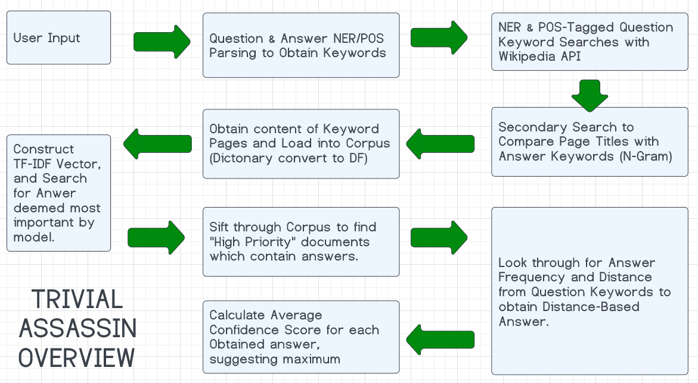

    

# Introduction

I'm an avid trivia fan, and I have always loved playing games like HQTrivia, Trivia Crack, Jeapordy,
Trivial Pursuit, QuizUp, and more. For however much playing is fun... winning is a lot more fun! One
way to win might be to get an advantage with an application or script, which is what *Trivial
Assassin* is all about. 

Back in 2019, I created a small Python program for the Flyer Prize coding competition - where the
objective was to create a program that could easily, quickly, and accurately solve a set of trivia
questions. The program would start by relying on a human operator to input a set of search
keywords and a set of 4 answers based on the question provided. The program would then return a list of possible answer pages pulled with the
wikipedia API. The operator would have to select the most-likely page (if the results didn't contain
an answer), and then the program would look for answer occurences in the selected page, and suggest an
answer that had the most keywords within proximity of it. In the case there were multiple, a small
paragraph containing the answer and about 100 words before and after were printed. Due to how it
worked, we called the application *Trivial Killer*, because using a program to solve the questions
was kind of kills the fun of playing a trivia game and makes solving things... trivial. For what it was,
this application was great to give you an answer, but required a lot of manual intervention relying
on the operator and the operator's level of knowledge and acuity when using the application.

# Purpose

There HAS to be a better way of solving these questions, right? Couldn't we use some natural
language processing (NLP) magic to remove some operator-intervention? from *Trivial Killer*?

This is where *Trivial Assassin* comes in.Often times, the term *Assassin* has more
accuracy and sophistication associated as a sentiment than *Killer* does, hence the name change. The purpose
of *Trivial Assassin* is to have increase accuracy regarding prediction of answers for multiple
choice answers and decrease the need for operator intervention when copared to *Trivial Killer*.
Through the application of various NLP techniqes including the use of POS-tagging, TF-IDF models,
n-grams, and named entity recognition, *Trivial Assassin* will hopefully be able to take on any
trivia-game related mission and wipe out the competition with ease!

However, just because the name contains "Trivial" - the task of acheiving the defined purpose was
certainly non-trivial!

# Program Descriptions & Usage

**Trivial Assassin: trivial_assassin.py**

This program is the base version of trivial assassin and takes input from the user in the form of a single question as well as comma-spaced answers when
prompted by the program. The program will output answer identifications for: Answers obtained from a
keyword search, TF-IDF Answer Identification, and Keyword-to-Answer Distance Identification. A final
answer is provided, and the metrics for each answer may be used by a human operation to make the
best determination. Can be run with ./trivial_assassin.py. Example:
~~~~~~~~~~~~~~~~~~~~~~~~~~~~~~~~~~~~~~~~~~~~~~~~~~
.--------------------------------------------------
Trivial Assassin V3.2
.--------------------------------------------------
Please enter a trivia question:
What is the first color of the rainbow? 

Please enter a comma-seperated list of potential answers (ex. red, blue, green):
Red, Green, Blue

Question: What is the first color of the rainbow?  ||  Answers: Red, Green, Blue

TF-IDF Answer Identification

        Blue  -  SCORE: 45.42% LIKELIHOOD
        Red  -  SCORE: 32.1% LIKELIHOOD
        Green  -  SCORE: 22.48% LIKELIHOOD

        IDENTIFIED ANSWER FROM TF-IDF SEARCH: ('Blue', 45.42)

Keyword-to-Answer Distance Identification

        Red  -  SCORE: 100.0% LIKELIHOOD

        IDENTIFIED ANSWER FROM KEYWORD-TO-ANSWER DISTANCE COMPARISON: ('Red', 100.0)

TOP ANSWER SELECTION: Red  ||  CONFIDENCE: 100.0% LIKELIHOOD  ||  METHODS SUPPORTING CHOICE: 1
~~~~~~~~~~~~~~~~~~~~~~~~~~~~~~~~~~~~~~~~~~~~~~~~~~

**Trivial Assassin - Mission: trivial_assassin_mission.py**

This program is the extended version, which allows users to load in a CSV containing trivia
questions, sets of answers, and the correct answer. The program will run through the set of
questions and compare suggested answers to the actual correct answer in order to determine overall
accuracy of the program. CSV example tests have been provided in the Data folder. Questions and
answers must be contained in quotation marks.

~~~~~~~~~~~~~~~~~~~~~~~~~~~~~~~~~~~~~~~~~~~~~~~~~~~~~~
--------------------------------------------------
Trivial Assassin Mission V3.2
--------------------------------------------------
Trivial Assassin Mission is a method to test the assassin against a list of given questions, answers, and the correct answer. Examples have been provided within the data directory.
Please enter a file path pointing to a CSV file containing the list of questions to test with:
./Data/Example.csv

Question: Which core ingredient is important to cook a savory dish?  ||  Answers: Salt, Butter, Sugar, Spice

TF-IDF Answer Identification
~~~~~~~~~~~~~~~~~~~~~~~~~~~~~~~~~~~~~~~~~~~~~~~~~~
        Sugar  -  SCORE: 42.81% LIKELIHOOD
        Salt  -  SCORE: 38.35% LIKELIHOOD
        Butter  -  SCORE: 10.9% LIKELIHOOD
        Spice  -  SCORE: 7.94% LIKELIHOOD

        IDENTIFIED ANSWER FROM TF-IDF SEARCH: ('Sugar', 42.81)

Keyword-to-Answer Distance Identification
~~~~~~~~~~~~~~~~~~~~~~~~~~~~~~~~~~~~~~~~~~~~~~~~~~
        Salt  -  SCORE: 95.11% LIKELIHOOD
        Butter  -  SCORE: 4.89% LIKELIHOOD

        IDENTIFIED ANSWER FROM KEYWORD-TO-ANSWER DISTANCE COMPARISON: ('Salt', 95.11)

TOP ANSWER SELECTION: Salt  ||  CONFIDENCE: 95.11% LIKELIHOOD  ||  METHODS SUPPORTING CHOICE: 1
salt:butter
____________________________________________________________________________________________________

Question: Brazil is the biggest producer of?  ||  Answers: Rice, Oil, Coffee, Linen

TF-IDF Answer Identification
~~~~~~~~~~~~~~~~~~~~~~~~~~~~~~~~~~~~~~~~~~~~~~~~~~
        Oil  -  SCORE: 48.02% LIKELIHOOD
        Coffee  -  SCORE: 46.01% LIKELIHOOD
        Rice  -  SCORE: 5.97% LIKELIHOOD
        Linen  -  SCORE: 0.0% LIKELIHOOD

        IDENTIFIED ANSWER FROM TF-IDF SEARCH: ('Oil', 48.02)

Keyword-to-Answer Distance Identification
~~~~~~~~~~~~~~~~~~~~~~~~~~~~~~~~~~~~~~~~~~~~~~~~~~
        Oil  -  SCORE: 0% LIKELIHOOD
        Rice  -  SCORE: 0% LIKELIHOOD

        IDENTIFIED ANSWER FROM KEYWORD-TO-ANSWER DISTANCE COMPARISON: ('Oil', 0)

TOP ANSWER SELECTION: Oil  ||  CONFIDENCE: 24.01% LIKELIHOOD  ||  METHODS SUPPORTING CHOICE: 2
oil:oil
____________________________________________________________________________________________________
Result: INCORRECT  ||  Question: Which core ingredient is important to cook a savory dish?  ||  Suggested Answer: salt  ||  Confidence Score: 95.11%  ||  Supporting Identifiers: 1  ||  Correct Answer: Butter
Result: CORRECT  ||  Question: Brazil is the biggest producer of?  ||  Suggested Answer: oil  ||  Confidence Score: 24.01%  ||  Supporting Identifiers: 2  ||  Correct Answer: Oil

OVERALL RESULTS
--------------------------------------------------
        Total Correct: 1 (50%)
        Average Correct Confidence Score: 5.87% # THIS VALUE IS INCORRECT, TO BE FIXED IN LATER VERSION
        Total Incorrect: 1 (50%)
        Average Incorrect Confidence Score: 6% # THIS VALUE IS INCORRECT, TO BE FIXED IN LATER VERSION
~~~~~~~~~~~~~~~~~~~~~~~~~~~~~~~~~~~~~~~~~~~~~~~~~~~~~~

## Other Versions

**Trivial Assassin - Double Agent: double_agent.py**

This program is the full package containing both single and multi-solve capabilities. The program
will prompt the user for input depending on how many questions they want solved. Then, the program
either initiates the original version or the new version. This version also has the entire codebase
in it, not seperated out into components. It was useful for debugging and it's there if you want to
see the full length of the program. It's about 865 lines in total.

**Trivial Assassin in Training - DEPRECATED**

Youngest version of the program. This one works and is the most similar to Trivial-Killer!

# Program Overview

    

**USER INPUT**
_____
Starting with user input, the user is expected to provide a multiple choice question and a
comma-space seperated set of answers.

        COMPONENT FILE: trivial_assassin/mission.py or double_agent.py

        METHODS INVOLVED: main()

**Q&A PARSING**
_____
In order to obtain keywords for searches, questions are taken and parsed into three priority-lists.
NER is conducted on the question, and these terms are sorted into priority-list A. The question is
then cleaned and POS-tagged. NNP|CD|NN (proper nouns, numbers, nouns) are sorted into priority-list
B. List C contains other potentially helpful words like adjectives.

Answers are parsed out and converted to lowercase.

        COMPONENT FILE: _QAParsing.py

        METHODS INVOLVED: parseQuestion(), parseAnswers()

**QUESTION KEYWORD SEARCHES WITH WIKIPEDIA API**
_____
Searches are conducted with the NER and POS Question Keywords. For each keyword in the list, they
are combined together (bi-gram, tri-gram, n-gram) and used against the wikipedia.search function.
This occurs until an answer is identified in the results list from the search function.

        COMPONENT FILE: _KeywordSearch.py

        METHODS INVOLVED: searchNamedEntityRecognitionKeywordPages(), searchPartOfSpeechKeywordPages()

**SECONDARY SEARCH TO COMPARE PAGE TITLES WITH ANSWER KEYWORDS**
_____
For each result identified within the combined POS-tagged and NER list, they are checked against the
list of answers and the amount of occurences of each are identified. If no answers are identified,
then the corpus will contain the set of combined NER and POS occurrences. If one answer is
identified, the result will be returned in a specific solved_state to trigger the answer suggestion
with the results of the list containing the answers. If more than one answer is identified, the
indexes are saved with the term and a corresponding dictionary - those will be the keyword pages that will make up the corpus.

        COMPONENT FILE: _KeywordSearch.py

        METHODS INVOLVED: searchForKeywordPages(), determineSolvedState()

        
**OBTAIN CONTENT OF KEYWORD PAGES AND LOAD INTO CORPUS**
_____
For each suggested result rendered from the keyword result, the page for the corresponding title
will be loaded into a dictionary. The dictionary of documents is then loaded into a dataframe.        

        COMPONENT FILE: _TFIDF.py

        METHODS INVOLVED: cleanKeywordPage(), composeCorpusFromKeywordPages(), composeCorpusFromTargetedKeywordPages(), createKeywordCorpusDF()

        
**CONSTRUCT TF-IDF VECTOR AND SEARCH FOR TF-IDF (MOST IMPORTANT) ANSWER**
_____
Using the dataframe for the documents and titles, a TF-IDF vector is created. Iterating through the
terms in the vocabulary, the answers are checked for. The most-important answer is set as the
highest-scoring, and the average of all scores is taken to identify an answer.

        COMPONENT FILE: _TFIDF.py

        METHODS INVOLVED: calculateKeywordCorpusTFIDF(), obtainAnswerFromTFIDF()

        
**SIFT THROUGH CORPUS TO FIND HIGH PRIORITY DOCUMENTS**
_____
Find frequency of answers and terms within the high priority documents. Provide the document
information and corresponding scores.

        COMPONENT FILE: _KeywordDistance.py

        METHODS INVOLVED: obtainWordDistance(), obtainHighPriorityDocs()

        
**LOOK THROUGH HIGH PRIORITY DOCUMENTS TO CALCULATE DISTANCE-BASED ANSWER BETWEEN ANSWER KEYWORDS AND QUESTION KEYWORDS**
_____
For each anser in each document, the distance between the term and the answer is calculated. The
minimum-distance should be favored and weighted accordingly with the score. The suggested answer is
provided accordingly.

        COMPONENT FILE: _KeywordDistance.py

        METHODS INVOLVED: obtainBestGuessFromDF()

        
**CALCULATE AVERAGE ANSWER SCORE AND RETURN SUGGESTED ANSWER**
_____
Taking the scores from the three answer-types provided, take the average and suggest the top-scoring one.

        COMPONENT FILE: trivial_assassin/mission.py or double_agent.py

        METHODS INVOLVED: solve_question() or solve_multiple_questions()

        
# Testing, Difficulties. & Current "Features" (Bugs)

I won't sugar coat this, *Trivial Assassin* was quite the programming journey to go through. Because
I had the earlier version, I thought this would be a cakewalk to integrate NLP. Was it? NO! There
are still so many difficulties. Here's my list of greivances with the current application.

* Sometimes, the wikipedia api I'm using doesn't catch the subsections. Often times, this renders
  every document in the keyword corpus not having a single occurence of an answer show up in TF-IDF.
  This means that 0% scores will be given for nearly everything. I've tried fixing this using
  another API, but it's just a massive undertaking to try to rip out the current system.

* When no answers are found, the default answer is given as the first answer. This means that if a
  test set has the answers in all the same positions, the correct answers will inflate the accuracy
  total.
  
* It was SUPER not-fun trying to do the distance searches, and in the end sometimes they make sense
  and sometimes they just don't. More often than not, TF-IDF usually catches the correct answer I've
  found with the example sets. If TF-IDF isn't correct, then keyword usually is.

* Determining which keywords to use for searches was awful when I was using all of them. By
  incrementing the N-gram used for the search, I saw a boost in accuracy by nearly 10%. That being
  said, it makes the program run so incredibly slowly.

* Not all trivia questions are the same! The program will likely give you the wrong answer for
  multiple choice if it's looking for "anything except" where only one of the answers is wrong. The
  frequency/importance was great for identifying terms and sometimes years. However, understanding
  the questions to such an intelligent level would likely make this program move very slowly in
  order to increase accuracy.

* In the end, the program still relies on the human operator to make a judgement call based on the
  metrics provided. It does happen to provide more insight in the end.

* Score calculations are wonky. Like, really wonky. Like, for Double Agent / Mission end metrics,
  the average scores are way off. This may be due to some answers having a 0% likelyhood if an
  answer was not found.

# Reflections

In the end, it was interesting to see how much insight TF-IDF gave when predicting answers.
Previosly, Trivial Killer could only use one page to work with at a time. If the operator chose the
wrong page, so much time would be lost. Loading them into a corpus was a great feature to be
implemented and definitely helps in the long run. Using NLP made the process of picking keywords out from a question a breeze. This takes a lot of
complexity of learning the tool out of play when compared to trivial killer. In that way, it's more
sophisticated when looking at POS-tagging for keywords. Also, using n-gram for the keywords to craft
searches ended up working out pretty well and had a good increase in accuracy. Named Entity
Recognition worked less-well than I hoped it would within the project, but it got the job done for
what it was. 

I had such a fun time with this project and this class. Thank you!

# Test-Case - 20 Trivia Questions ==> Test_Set.csv
Just an example to demonstrate functionality of the "Mission" application of Trivial Assassin,
here's the output of what it looks like.

~~~~~~~~~~~~~~~~~~~~~~~
--------------------------------------------------
Trivial Assassin Mission V3.2
--------------------------------------------------
Trivial Assassin Mission is a method to test the assassin against a list of given questions, answers, and the correct answer. Examples have been provided within the data directory.
Please enter a file path pointing to a CSV file containing the list of questions to test with:
./Data/Test_Set.csv

Question: Which popular Disney show was Miley Cyrus part of?  ||  Answers: Hannah Montana, Shake It Up, Jessie, The Suite Life of Zach and Cody
KEYWORD SEARCH RESULT FOUND
--------------------------------------------------
        IDENTIFIED ANSWER: Hannah Montana

Question: Which two colors mix to form pink?  ||  Answers: Grey and Orange, White and Red, Black and Blue, Green and Purple

TF-IDF Answer Identification
~~~~~~~~~~~~~~~~~~~~~~~~~~~~~~~~~~~~~~~~~~~~~~~~~~
        White And Red  -  SCORE: 36.98% LIKELIHOOD
        Black And Blue  -  SCORE: 33.96% LIKELIHOOD
        Green And Purple  -  SCORE: 22.57% LIKELIHOOD
        Grey And Orange  -  SCORE: 6.5% LIKELIHOOD

        IDENTIFIED ANSWER FROM TF-IDF SEARCH: ('White And Red', 36.98)

Keyword-to-Answer Distance Identification
~~~~~~~~~~~~~~~~~~~~~~~~~~~~~~~~~~~~~~~~~~~~~~~~~~

        IDENTIFIED ANSWER FROM KEYWORD-TO-ANSWER DISTANCE COMPARISON: ('', 0)

TOP ANSWER SELECTION: White And Red  ||  CONFIDENCE: 36.98% LIKELIHOOD  ||  METHODS SUPPORTING CHOICE: 1
white and red:white and red
____________________________________________________________________________________________________

Question: When did Prince William and Kate Middleton get married?  ||  Answers: 2010, 2011, 2012, 2014

TF-IDF Answer Identification
~~~~~~~~~~~~~~~~~~~~~~~~~~~~~~~~~~~~~~~~~~~~~~~~~~
        2011  -  SCORE: 31.55% LIKELIHOOD
        2014  -  SCORE: 24.22% LIKELIHOOD
        2012  -  SCORE: 22.92% LIKELIHOOD
        2010  -  SCORE: 21.31% LIKELIHOOD

        IDENTIFIED ANSWER FROM TF-IDF SEARCH: ('2011', 31.55)

Keyword-to-Answer Distance Identification
~~~~~~~~~~~~~~~~~~~~~~~~~~~~~~~~~~~~~~~~~~~~~~~~~~
        2010  -  SCORE: 100.0% LIKELIHOOD

        IDENTIFIED ANSWER FROM KEYWORD-TO-ANSWER DISTANCE COMPARISON: ('2010', 100.0)

TOP ANSWER SELECTION: 2010  ||  CONFIDENCE: 100.0% LIKELIHOOD  ||  METHODS SUPPORTING CHOICE: 1
2010:2011
____________________________________________________________________________________________________

Question: Which music song was on top of the hit list throughout the year 2016?  ||  Answers: One Dance, Love Story, Rude, Bitter Water

TF-IDF Answer Identification
~~~~~~~~~~~~~~~~~~~~~~~~~~~~~~~~~~~~~~~~~~~~~~~~~~
        Love Story  -  SCORE: 65.76% LIKELIHOOD
        One Dance  -  SCORE: 34.24% LIKELIHOOD
        Rude  -  SCORE: 0.0% LIKELIHOOD
        Bitter Water  -  SCORE: 0.0% LIKELIHOOD

        IDENTIFIED ANSWER FROM TF-IDF SEARCH: ('Love Story', 65.76)

Keyword-to-Answer Distance Identification
~~~~~~~~~~~~~~~~~~~~~~~~~~~~~~~~~~~~~~~~~~~~~~~~~~

        IDENTIFIED ANSWER FROM KEYWORD-TO-ANSWER DISTANCE COMPARISON: ('', 0)

TOP ANSWER SELECTION: Love Story  ||  CONFIDENCE: 65.76% LIKELIHOOD  ||  METHODS SUPPORTING CHOICE: 1
love story:one dance
____________________________________________________________________________________________________

Question: `Famous for their work on modernist furniture design, Charles and Ray Eames were related how?  ||  Answers: Son and Father, Mother and Daughter, Husband and Wife

TF-IDF Answer Identification
~~~~~~~~~~~~~~~~~~~~~~~~~~~~~~~~~~~~~~~~~~~~~~~~~~
        Husband And Wife  -  SCORE: 47.05% LIKELIHOOD
        Son And Father  -  SCORE: 28.74% LIKELIHOOD
        Mother And Daughter  -  SCORE: 24.21% LIKELIHOOD

        IDENTIFIED ANSWER FROM TF-IDF SEARCH: ('Husband And Wife', 47.05)

Keyword-to-Answer Distance Identification
~~~~~~~~~~~~~~~~~~~~~~~~~~~~~~~~~~~~~~~~~~~~~~~~~~

        IDENTIFIED ANSWER FROM KEYWORD-TO-ANSWER DISTANCE COMPARISON: ('', 0)

TOP ANSWER SELECTION: Husband And Wife  ||  CONFIDENCE: 47.05% LIKELIHOOD  ||  METHODS SUPPORTING CHOICE: 1
husband and wife:husband and wife
____________________________________________________________________________________________________

Question: A 1985 North Atlantic expedition led by Robert Ballard discovered the wreck of what famous ship 73 years after it sank?  ||  Answers: Titanic, Edmund Fitzgerald, Treadwell, Mayflower
KEYWORD SEARCH RESULT FOUND
--------------------------------------------------
        IDENTIFIED ANSWER: Titanic

Question: A 2010 Billboard hit,”Dog Days are Over” is a song by the British band “Florence and the” what?  ||  Answers: Machine, Yellow Submarine, Foo Fighters, Studs

TF-IDF Answer Identification
~~~~~~~~~~~~~~~~~~~~~~~~~~~~~~~~~~~~~~~~~~~~~~~~~~
        Machine  -  SCORE: 100.0% LIKELIHOOD
        Yellow Submarine  -  SCORE: 0.0% LIKELIHOOD
        Foo Fighters  -  SCORE: 0.0% LIKELIHOOD
        Studs  -  SCORE: 0.0% LIKELIHOOD

        IDENTIFIED ANSWER FROM TF-IDF SEARCH: ('Machine', 100.0)

Keyword-to-Answer Distance Identification
~~~~~~~~~~~~~~~~~~~~~~~~~~~~~~~~~~~~~~~~~~~~~~~~~~
        Machine  -  SCORE: 0% LIKELIHOOD

        IDENTIFIED ANSWER FROM KEYWORD-TO-ANSWER DISTANCE COMPARISON: ('Machine', 0)

TOP ANSWER SELECTION: Machine  ||  CONFIDENCE: 50.0% LIKELIHOOD  ||  METHODS SUPPORTING CHOICE: 2
machine:machine
____________________________________________________________________________________________________

Question: A 2011 box set celebrates the 13-film collaboration between composer Danny Elfman and what film director?  ||  Answers: Tim Burton, Wes Anderson, Alice Cooper, Steven Spielburg

TF-IDF Answer Identification
~~~~~~~~~~~~~~~~~~~~~~~~~~~~~~~~~~~~~~~~~~~~~~~~~~
        Tim Burton  -  SCORE: 95.29% LIKELIHOOD
        Alice Cooper  -  SCORE: 4.71% LIKELIHOOD
        Wes Anderson  -  SCORE: 0.0% LIKELIHOOD
        Steven Spielburg  -  SCORE: 0.0% LIKELIHOOD

        IDENTIFIED ANSWER FROM TF-IDF SEARCH: ('Tim Burton', 95.29)

Keyword-to-Answer Distance Identification
~~~~~~~~~~~~~~~~~~~~~~~~~~~~~~~~~~~~~~~~~~~~~~~~~~
        Tim Burton  -  SCORE: 100.0% LIKELIHOOD

        IDENTIFIED ANSWER FROM KEYWORD-TO-ANSWER DISTANCE COMPARISON: ('Tim Burton', 100.0)

TOP ANSWER SELECTION: Tim Burton  ||  CONFIDENCE: 97.65% LIKELIHOOD  ||  METHODS SUPPORTING CHOICE: 2
tim burton:tim burton
____________________________________________________________________________________________________

Question: A bit in a gossip column that doesn’t mention any names is often called a what?  ||  Answers: Blind Item, Reputable Source of Information, Dish Rag, Tea Spill
KEYWORD SEARCH RESULT FOUND
--------------------------------------------------
        IDENTIFIED ANSWER: Blind Item

Question: A blacksmith works primarily with what metal?  ||  Answers: Iron, Aluminum, Zinc, Gold

TF-IDF Answer Identification
~~~~~~~~~~~~~~~~~~~~~~~~~~~~~~~~~~~~~~~~~~~~~~~~~~
        Iron  -  SCORE: 81.04% LIKELIHOOD
        Gold  -  SCORE: 16.54% LIKELIHOOD
        Aluminum  -  SCORE: 2.42% LIKELIHOOD
        Zinc  -  SCORE: 0.0% LIKELIHOOD

        IDENTIFIED ANSWER FROM TF-IDF SEARCH: ('Iron', 81.04)

Keyword-to-Answer Distance Identification
~~~~~~~~~~~~~~~~~~~~~~~~~~~~~~~~~~~~~~~~~~~~~~~~~~
        Iron  -  SCORE: 100.0% LIKELIHOOD

        IDENTIFIED ANSWER FROM KEYWORD-TO-ANSWER DISTANCE COMPARISON: ('Iron', 100.0)

TOP ANSWER SELECTION: Iron  ||  CONFIDENCE: 90.52% LIKELIHOOD  ||  METHODS SUPPORTING CHOICE: 2
iron:iron
____________________________________________________________________________________________________

Question: A bushel is a standard unit originally used to measure the weight of what?  ||  Answers: Grain, Iron, Cheese, Paper

TF-IDF Answer Identification
~~~~~~~~~~~~~~~~~~~~~~~~~~~~~~~~~~~~~~~~~~~~~~~~~~
        Grain  -  SCORE: 100.0% LIKELIHOOD
        Iron  -  SCORE: 0.0% LIKELIHOOD
        Cheese  -  SCORE: 0.0% LIKELIHOOD
        Paper  -  SCORE: 0.0% LIKELIHOOD

        IDENTIFIED ANSWER FROM TF-IDF SEARCH: ('Grain', 100.0)

Keyword-to-Answer Distance Identification
~~~~~~~~~~~~~~~~~~~~~~~~~~~~~~~~~~~~~~~~~~~~~~~~~~
        Grain  -  SCORE: 0% LIKELIHOOD
        Cheese  -  SCORE: 0% LIKELIHOOD

        IDENTIFIED ANSWER FROM KEYWORD-TO-ANSWER DISTANCE COMPARISON: ('Grain', 0)

TOP ANSWER SELECTION: Grain  ||  CONFIDENCE: 50.0% LIKELIHOOD  ||  METHODS SUPPORTING CHOICE: 2
grain:grain
____________________________________________________________________________________________________

Question: A classic 1969 work by poet Maya Angelou is titled “I Know Why The Caged Bird” what?  ||  Answers: Sings, Flaps, Coughs, Dies
KEYWORD SEARCH RESULT FOUND
--------------------------------------------------
        IDENTIFIED ANSWER: Sings

Question: A classic 1984 Super Bowl commercial titled “1984” introduced what product to the public?  ||  Answers: Macintosh Computer, iPod, iPad, Sliced Bread

TF-IDF Answer Identification
~~~~~~~~~~~~~~~~~~~~~~~~~~~~~~~~~~~~~~~~~~~~~~~~~~
        Macintosh Computer  -  SCORE: 87.74% LIKELIHOOD
        Ipod  -  SCORE: 12.26% LIKELIHOOD
        Ipad  -  SCORE: 0.0% LIKELIHOOD
        Sliced Bread  -  SCORE: 0.0% LIKELIHOOD

        IDENTIFIED ANSWER FROM TF-IDF SEARCH: ('Macintosh Computer', 87.74)

Keyword-to-Answer Distance Identification
~~~~~~~~~~~~~~~~~~~~~~~~~~~~~~~~~~~~~~~~~~~~~~~~~~
        Ipod  -  SCORE: 100.0% LIKELIHOOD
        Macintosh Computer  -  SCORE: 0.0% LIKELIHOOD

        IDENTIFIED ANSWER FROM KEYWORD-TO-ANSWER DISTANCE COMPARISON: ('Ipod', 100.0)

TOP ANSWER SELECTION: Ipod  ||  CONFIDENCE: 100.0% LIKELIHOOD  ||  METHODS SUPPORTING CHOICE: 1
ipod:macintosh computer
____________________________________________________________________________________________________

Question: A close friend of her Greek actor father,Telly Savalas was the godfather of which of these movie stars?  ||  Answers: Jennifer Aniston, Brad Pitt, Angelina Jolie, Keanu Reeves
KEYWORD SEARCH RESULT FOUND
--------------------------------------------------
        IDENTIFIED ANSWER: Jennifer Aniston

Question: A collection of Sanskrit hymns and verses known as the Vedas are sacred texts in what religion?  ||  Answers: Hinduism, Islam, Christianity

TF-IDF Answer Identification
~~~~~~~~~~~~~~~~~~~~~~~~~~~~~~~~~~~~~~~~~~~~~~~~~~
        Hinduism  -  SCORE: 100.0% LIKELIHOOD
        Islam  -  SCORE: 0.0% LIKELIHOOD
        Christianity  -  SCORE: 0.0% LIKELIHOOD

        IDENTIFIED ANSWER FROM TF-IDF SEARCH: ('Hinduism', 100.0)

Keyword-to-Answer Distance Identification
~~~~~~~~~~~~~~~~~~~~~~~~~~~~~~~~~~~~~~~~~~~~~~~~~~
        Hinduism  -  SCORE: 100.0% LIKELIHOOD

        IDENTIFIED ANSWER FROM KEYWORD-TO-ANSWER DISTANCE COMPARISON: ('Hinduism', 100.0)

TOP ANSWER SELECTION: Hinduism  ||  CONFIDENCE: 100.0% LIKELIHOOD  ||  METHODS SUPPORTING CHOICE: 2
hinduism:hinduism
____________________________________________________________________________________________________

Question: A college graduate who participates in an ROTC program graduates with a what?  ||  Answers: Military Commission,
GED, Officer's Recommendation Parchment, Scroll of Undying
C:\Users\murra\AppData\Local\Programs\Python\Python39\lib\site-packages\wikipedia\wikipedia.py:389: GuessedAtParserWarning: No parser was explicitly specified, so I'm using the best available HTML parser for this system ("html.parser"). This usually isn't a problem, but if you run this code on another system, or in a different virtual environment, it may use a different parser and behave differently.

The code that caused this warning is on line 389 of the file C:\Users\murra\AppData\Local\Programs\Python\Python39\lib\site-packages\wikipedia\wikipedia.py. To get rid of this warning, pass the additional argument 'features="html.parser"' to the BeautifulSoup constructor.

  lis = BeautifulSoup(html).find_all('li')

TF-IDF Answer Identification
~~~~~~~~~~~~~~~~~~~~~~~~~~~~~~~~~~~~~~~~~~~~~~~~~~
        Military Commission  -  SCORE: 0.0% LIKELIHOOD

Ged  -  SCORE: 0.0% LIKELIHOOD
        Officer Recommendation Parchment  -  SCORE: 0.0% LIKELIHOOD
        Scroll Of Undying  -  SCORE: 0.0% LIKELIHOOD

        IDENTIFIED ANSWER FROM TF-IDF SEARCH: ('Military Commission', 0.0)

Keyword-to-Answer Distance Identification
~~~~~~~~~~~~~~~~~~~~~~~~~~~~~~~~~~~~~~~~~~~~~~~~~~

        IDENTIFIED ANSWER FROM KEYWORD-TO-ANSWER DISTANCE COMPARISON: ('', 0)

TOP ANSWER SELECTION: Military Commission  ||  CONFIDENCE: 0.0% LIKELIHOOD  ||  METHODS SUPPORTING CHOICE: 1
military commission:military commission
____________________________________________________________________________________________________

Question: A common problem during childhood, nocturnal enuresis is a medical term better known as what?  ||  Answers: Bed Wetting, Spontaneous Death, Amnesia

TF-IDF Answer Identification
~~~~~~~~~~~~~~~~~~~~~~~~~~~~~~~~~~~~~~~~~~~~~~~~~~
        Bed Wetting  -  SCORE: 73.59% LIKELIHOOD
        Spontaneous Death  -  SCORE: 26.41% LIKELIHOOD
        Amnesia  -  SCORE: 0.0% LIKELIHOOD

        IDENTIFIED ANSWER FROM TF-IDF SEARCH: ('Bed Wetting', 73.59)

Keyword-to-Answer Distance Identification
~~~~~~~~~~~~~~~~~~~~~~~~~~~~~~~~~~~~~~~~~~~~~~~~~~
        Bed Wetting  -  SCORE: 0% LIKELIHOOD

        IDENTIFIED ANSWER FROM KEYWORD-TO-ANSWER DISTANCE COMPARISON: ('Bed Wetting', 0)

TOP ANSWER SELECTION: Bed Wetting  ||  CONFIDENCE: 36.8% LIKELIHOOD  ||  METHODS SUPPORTING CHOICE: 2
bed wetting:bed wetting
____________________________________________________________________________________________________

Question: A company known for its atlases and maps was born when William Rand went into business with whom?  ||  Answers: Andrew Mcnally, Jennifer Aniston, Stephen Hawking, Gerald Terellius

TF-IDF Answer Identification
~~~~~~~~~~~~~~~~~~~~~~~~~~~~~~~~~~~~~~~~~~~~~~~~~~
        Andrew Mcnally  -  SCORE: 100.0% LIKELIHOOD
        Jennifer Aniston  -  SCORE: 0.0% LIKELIHOOD
        Stephen Hawking  -  SCORE: 0.0% LIKELIHOOD
        Gerald Terellius  -  SCORE: 0.0% LIKELIHOOD

        IDENTIFIED ANSWER FROM TF-IDF SEARCH: ('Andrew Mcnally', 100.0)

Keyword-to-Answer Distance Identification
~~~~~~~~~~~~~~~~~~~~~~~~~~~~~~~~~~~~~~~~~~~~~~~~~~
        Andrew Mcnally  -  SCORE: 0% LIKELIHOOD

        IDENTIFIED ANSWER FROM KEYWORD-TO-ANSWER DISTANCE COMPARISON: ('Andrew Mcnally', 0)

TOP ANSWER SELECTION: Andrew Mcnally  ||  CONFIDENCE: 50.0% LIKELIHOOD  ||  METHODS SUPPORTING CHOICE: 2
andrew mcnally:andrew mcnally
____________________________________________________________________________________________________

Question: A contestant on the Fall 2011 season of “Dancing With The Stars,” Carson Kressley first gained fame on what reality show?  ||  Answers: Queer Eye, Degrassi, White Collar, RuPaul's Drag Race

TF-IDF Answer Identification
~~~~~~~~~~~~~~~~~~~~~~~~~~~~~~~~~~~~~~~~~~~~~~~~~~
        Rupaul Drag Race  -  SCORE: 100.0% LIKELIHOOD
        Queer Eye  -  SCORE: 0.0% LIKELIHOOD
        Degrassi  -  SCORE: 0.0% LIKELIHOOD
        White Collar  -  SCORE: 0.0% LIKELIHOOD

        IDENTIFIED ANSWER FROM TF-IDF SEARCH: ('Rupaul Drag Race', 100.0)

Keyword-to-Answer Distance Identification
~~~~~~~~~~~~~~~~~~~~~~~~~~~~~~~~~~~~~~~~~~~~~~~~~~
        Rupaul Drag Race  -  SCORE: 0% LIKELIHOOD

        IDENTIFIED ANSWER FROM KEYWORD-TO-ANSWER DISTANCE COMPARISON: ('Rupaul Drag Race', 0)

TOP ANSWER SELECTION: Rupaul Drag Race  ||  CONFIDENCE: 50.0% LIKELIHOOD  ||  METHODS SUPPORTING CHOICE: 2
rupaul drag race:queer eye
____________________________________________________________________________________________________

Result: CORRECT  ||  Question: Which two colors mix to form pink?  ||  Suggested Answer: white and red  ||  Confidence Score: 36.98%  ||  Supporting Identifiers: 1  ||  Correct Answer: White and Red
Result: INCORRECT  ||  Question: When did Prince William and Kate Middleton get married?  ||  Suggested Answer: 2010  ||  Confidence Score: 100.0%  ||  Supporting Identifiers: 1  ||  Correct Answer: 2011
Result: INCORRECT  ||  Question: Which music song was on top of the hit list throughout the year 2016?  ||  Suggested Answer: love story  ||  Confidence Score: 65.76%  ||  Supporting Identifiers: 1  ||  Correct Answer: One Dance
Result: CORRECT  ||  Question: `Famous for their work on modernist furniture design, Charles and Ray Eames were related how?  ||  Suggested Answer: husband and wife  ||  Confidence Score: 47.05%  ||  Supporting Identifiers: 1  ||  Correct Answer: Husband and Wife
Result: CORRECT  ||  Question: A 2010 Billboard hit,”Dog Days are Over” is a song by the British band “Florence and the” what?  ||  Suggested Answer: machine  ||  Confidence Score: 50.0%  ||  Supporting Identifiers: 2  ||  Correct Answer: Machine        
Result: CORRECT  ||  Question: A 2011 box set celebrates the 13-film collaboration between composer Danny Elfman and what film director?  ||  Suggested Answer: tim burton  ||  Confidence Score: 97.65%  ||  Supporting Identifiers: 2  ||  Correct Answer: Tim Burton
Result: CORRECT  ||  Question: A blacksmith works primarily with what metal?  ||  Suggested Answer: iron  ||  Confidence Score: 90.52%  ||  Supporting Identifiers: 2  ||  Correct Answer: Iron
Result: CORRECT  ||  Question: A bushel is a standard unit originally used to measure the weight of what?  ||  Suggested Answer: grain  ||  Confidence Score: 50.0%  ||  Supporting Identifiers: 2  ||  Correct Answer: Grain
Result: INCORRECT  ||  Question: A classic 1984 Super Bowl commercial titled “1984” introduced what product to the public?  ||  Suggested Answer: ipod  ||  Confidence Score: 100.0%  ||  Supporting Identifiers: 1  ||  Correct Answer: Macintosh Computer   
Result: CORRECT  ||  Question: A collection of Sanskrit hymns and verses known as the Vedas are sacred texts in what religion?  ||  Suggested Answer: hinduism  ||  Confidence Score: 100.0%  ||  Supporting Identifiers: 2  ||  Correct Answer: Hinduism     
Result: CORRECT  ||  Question: A college graduate who participates in an ROTC program graduates with a what?  ||  Suggested Answer: military commission  ||  Confidence Score: 0.0%  ||  Supporting Identifiers: 1  ||  Correct Answer: Military Commission   
Result: CORRECT  ||  Question: A common problem during childhood, nocturnal enuresis is a medical term better known as what?  ||  Suggested Answer: bed wetting  ||  Confidence Score: 36.8%  ||  Supporting Identifiers: 2  ||  Correct Answer: Bed Wetting  
Result: CORRECT  ||  Question: A company known for its atlases and maps was born when William Rand went into business with whom?  ||  Suggested Answer: andrew mcnally  ||  Confidence Score: 50.0%  ||  Supporting Identifiers: 2  ||  Correct Answer: Andrew Mcnally
Result: INCORRECT  ||  Question: A contestant on the Fall 2011 season of “Dancing With The Stars,” Carson Kressley first gained fame on what reality show?  ||  Suggested Answer: rupaul drag race  ||  Confidence Score: 50.0%  ||  Supporting Identifiers: 2  ||  Correct Answer: Queer Eye

OVERALL RESULTS
--------------------------------------------------
        Total Correct: 10 (71.43%)
        Average Correct Confidence Score: 5.59%
        Total Incorrect: 4 (28.57%)
        Average Incorrect Confidence Score: 8%
--------------------------------------------------

